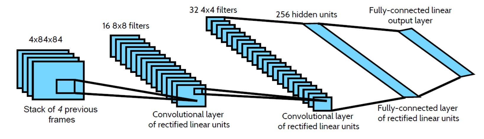
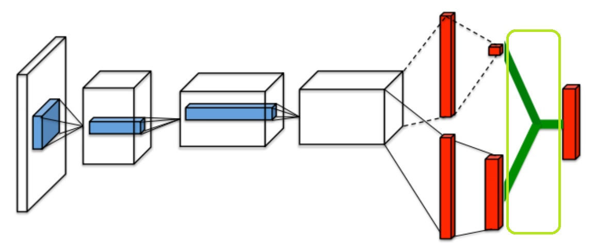
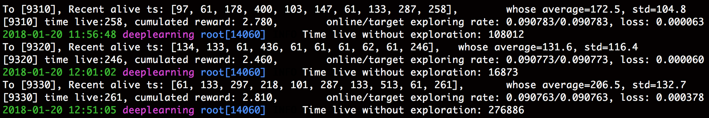

# DL_contest5_codes_viewing
(This readme is actually our report of contest 5)

# Deep Learning DataLabCup 5 Report
## Deep Reinforcement Learning

組員
- 103062224 劉哲宇
- 103062240 蔡宗宇
- 103062101 陳孜宇

隊伍名稱
- 小鳥與他的快樂夥伴們

# Codes
Here are the [codes](https://github.com/Nash2325138/DL_contest5_codes_viewing) with the best score on kaggle. If you want to run it, just clone all the files down and follow the usage examples:

### Examples

Start training from the beginning: <br>
``` python Try_dueling.py ```

Speicify a model name: (It's neccesary because we've experimented on more than one models) <br>
``` python Try_dueling.py --store-name <store_name>```

Resume from a checkpoint: <br>
``` python Try_dueling.py --restore <episode_number> ```

Calculate the score using the evaluation function TA provided: <br>
``` python Try_dueling.py --restore <episode_number> --resotre```

Perform a random episode with only exploitation: <br>
``` python Try_dueling.py --restore <episode_number> --exploit-show```

For other arguments, take a look at: <br>
```python Try_dueling.py -h```

If you need to rerun the code with our selected model and checkpoint used on Kaggle: <br>
``` --store-name dualing_DQN_newR_target15k --resotre 4360 ```

## Other implementation:
The above codes are the best model we have before competition ends, but there is some other implementation we've done:

- [RNN](https://github.com/Nash2325138/DL_contest5_codes_viewing/blob/master/Try_LSTM.py) with LSTM for different timestep: This is done after  the method to run the python script is almost the same as Try_dueling.py, e.g. ``` python Try_LSTM.py --store-name duel_LSTM --restore 9360 --exploit-show ```
- [Bird.py](https://github.com/Nash2325138/DL_contest5_codes_viewing/blob/master/Bird.py): Another implementation modified from [this repo](https://github.com/yenchenlin/DeepLearningFlappyBird).

# What We Did

## Data Preprocessing

1) Assets Replacement

依照 notebook 的指示將遊戲背景換成純黑，以及將鳥與管子的顏色固定(有利於 Model Converge)。

2) Input Screen Preprocessing

對於每張遊戲畫面(由 PLE 的 getScreenGrayScale() 得到的圖)，我們先將他 resize 成固定大小(80x80)，在餵進 model 前，將圖片轉成 float(值域\[0.0, 1.0\])，選擇在餵進 model 前才轉換的原因主要是：若先轉完的話，Data 單位會從 unsigned byte 轉成float，需要較大的記憶體空間來保存，因為螢幕截圖會被留在 Replay Memory (Replay Buffer)內，會有很可觀的記憶體消耗。

## Model Design


### Base Network

我們以 lab17 上所提供的 network 架構為基礎，去做後續的修改：



我們作為基礎的network與lab notebook上所給的範例相同，即
Input Screens (80 x 80 x 4)會經過：
- Convolution: 32 8 x 8 filters with stride \[4, 4\]
- 2 x 2 Max Pooling with stride \[2, 2\]
- Convolution: 64 4 x 4 filters with stride \[2, 2\]
- Convolution: 64 3 x 3 filters with stride \[1, 1\]
- Flatten Layer
- Dense Layer with 512 hidden units
- Dense Layer with 2 units

### Delayed Target Network

因為 Agent 的 weights 如果在訓練過程中被頻繁修改，會使 gradient decent 實質上是在追逐一個 moving target，導致訓練過程的不穩定。因此我們加入了老師影片所提到、lab 中也有實作的 "Delayed Target Network" 技巧：<br>
使用兩個相同的 network 架構的 target agent and online agent，前者估計 target Q value 並依此計算後者的 loss，後者在對算出來的 loss 做 gradient decent to update weights。等到經過數個 timestep 的 update 後，將 target agent 更新為 online agent (assign target network weights = online network weights)。

在我們表現最好的模型中，一開始的是每 20 個 episode 做一次 update target agent，但因為每個 episode 的存活時間不一樣，會導致後來每次更新的週期都不一樣（以 timestep 作為單位），尤其是模型的前期與後期表現出現差距時，此問題更加明顯。<br>
令更新週期為 K timestep，我們簡單實驗了 K=10000, K=15000 兩個情況，認為 K=15000 會稍微好一點(但並不顯著)

### Experience Replay Buffer

如果直接把 agent 剛經歷過的 state transition and reward 作為 training examples，那麼連續的 samples 之間大多不會滿足 identical independent distributed 的假設，使得訓練難以收斂。<br>
因此，我們也沿用了 Lab NoteBook 就有的 Replay Buffer，但是修改了 Lab 中每個 episode 才更新一次的設定，改為 online agent 每經過一個 timestep 就從 Replay Buffer 中 sample 一個 batch 做 gradient decent update。這麼做一方面更新頻率會高很多，也才會跟 pseudo-code 的所描述的一致。


### Dueling Network Architectures

根據 Hint 以及這篇[論文](https://arxiv.org/abs/1511.06581)，若在 network 中 explicitly predict V(s) and Advantage(s, a)，再將他們結合以預測 Q(s, a)，能夠使訓練穩定很多，因此我們對自己的 Q Network 做了如下圖的修改：


其中綠色框的 Operation，我們根據原論文的公式來實作：
$$ Q(s, a; \theta, \alpha, \beta) = V(s; \theta, \beta) + \big( A(s, a; \theta, \alpha) - \frac{1}{|A|} \sum_{a'}{}A(s, a'; \theta, \alpha) \big)$$

下面我們演示將其轉換成 tensorflow code 的結果：
```
# assume the final flatten layer to be flat
V_dense = tf.dense(inputs=flat, units=512, activation=tf.nn.relu)
V       = tf.dense(inputs=V_dense, units=1, activation=None)         # This is V()
A_dense = tf.dense(inputs=flat, units=512, activation=tf.nn.relu)
A       = tf.dense(inputs=A_dense, units=1, activation=None)         # This is A()

# Combine them using the formula
Q = V + A - tf.reduce_mean(A, axis=1, keep_dims=True)
```

## Training Process

主要利用 DQN Network 與 Seperated Networks 為基礎，大致上的 Pseudo Code 如下：

 </img>

即：每1個time step，做
- Get action a, reward r, next screen x'
- Append a tuple to replay memory
- Sample a mini batch from replay memory
- Do a gradient descent step

而在訓練開始前，我們會先確保 replay buffer 已經有一定數量的 tuples，避免在 buffer 還很小時使模型 sample 到 not i.i.d 的資料進行訓練。從上次中斷點開始訓練的時候，尤其要注意這個問題，我們在這次比賽過程中曾經就有訓練得不錯的 network 因爲這個原因而效果驟降。

### Change of Rewards
在 lab notebook 中，使用的 reward 如下：
- original rewards:
    - positive: 1
    - tick: 0.1
    - die: -1
    
經過觀察，我們的模型很容易滿足並維持於活到 timestep = 61，代表它連第一個管子都還沒通過，但至少也不會在撞到第一個管子前就碰到上下界線而結束。因此我們認為如果把通過一個管子的獎勵調得比存活 10 timestep 多一點，或許能改善這個問題。另外我們也認為死亡不應該可以只用通過一根柱子來抵消，因此把 environment reward 更改為：
- original rewards:
    - positive: 0.2
    - tick: 0.01
    - die: -1
    
雖然不知道有沒有運氣成份，但是更改過後的模型收斂速度就快了很多。


### Our Hyper Parameters
- input screen size: 80 x 80
- num stack: 4
- gamma: 0.99
- initial epsilon: 0.1
- replay memory size: 50000
- batch size: 32
- target network update frequency: 15000 time steps
- rewards:
    - positive: 0.2
    - tick: 0.01
    - die: -1

## Modified Parts in Given Sample Code (or Bugs Found)
### 1. Agent.shutdown_explore()
In the training process of lab 17, if episode reaches print_every_episode (dufault = 500), it will call online_agent.shutdown_explore(). It is to see how our model will work with only exploitation.

However, the exploring_rate (epsilon) of online_agent has never been set back to some value bigger than 0 since the first time we call shutdown_explore(). This makes the model never explore anymore, causing the training process unlikely to converge.

To fix this problem, we can modify Agent.update_parameters() like this:
```
    def update_parameters(self, episode):
        next_epsilon = self.init_epsilon - (self.init_epsilon - MIN_EXPLORING_RATE) * episode / 100000
        if next_epsilon > MIN_EXPLORING_RATE:
            self.exploring_rate =  next_epsilon
```
The function will be called after each episode ends, and at the same time it will reset the exploring rate depending on the total episodes the model has run for now, which makes resuming training from last checkpoint more convinient.

### 2. Agent.update_policy()
In the lab, we call online_agent.update_policy() **for every episode**. Nevertheless, the pseudo-code shows that we should sample a mini-batch and update our policy according to it **for every timestep**. Hence, we modify the position of this function call into the inner loop ``` while not env.game_over(): ```

After the modification, our training converges more quickly as we expected.

## Demo Videos
Before the competition ends, our best model (evaluated by alive time of the 100 hidden seed generated games) uses all the techniques, modification, and hyper-parameters mentioned above for training around 4360 episodes.

Here is a demo video we generated for a random episode with only exploitation. It lives at least for 12000 timestep and stops, because our poor memory can afford to store the screens if it continues to play.

<video controls src="Report/files/demo1.webm"/> <br>
(Since HTML5 video is not supported on github markdown, please refer to [./Report/files/demo1.webm](https://github.com/Nash2325138/DL_contest5_codes_viewing/blob/master/Report/files/demo1.webm))

It seems pretty good. However, for some rare situations, it's not able to live more than 1000 timesteps, which becomes the reason why we can't reach score 0 on kaggle (209 on private score).

## LSTM Model
We implemented a version where we use LSTM with its inputs being the features extracted by CNN from the 4 screens. However, there's no time for training before the competition ended. You can find the code [here](https://github.com/Nash2325138/DL_contest5_codes_viewing/blob/master/Try_LSTM.py).

After competition ended, I let the model run for a whole day. According to the standard output, this model actually performs well. It's recorded that this model can even be alive for more than 200k timesteps:



We didn't record its video because of the limitation of memory, but here's a version which lives for 12000 timestep (and is forced to stop due to memory):

<video controls src="./Report/files/demo2.webm"/>  <br>
(Since HTML5 video is not supported on github markdown, please refer to [./Report/files/demo2.webm](https://github.com/Nash2325138/DL_contest5_codes_viewing/blob/master/Report/files/demo2.webm))

If we evaluate the score (for the 100 hidden seeds), there's still few cases that the bird can't survive for more than 1000 timesteps.

## Conclusions

這次 Contest 中花了一點時間在 Trace Sample Code 上，因為提供的範例 Code 與原演算法的 Pseudo Code 有點差異，可能是這個原因導致一開始 train 出來的結果並不好（第一根管子都過不去），經修改後就好多了。而這次 contest 跟上一次的類似，最好的結果可能會發生在 training 的某個階段，但是 inference 時間稍長無法暴力測全部的 checkpoint，所以必須要透過訓練過程的輸出訊息中，盡量找出可能優秀的 checkpoint 來使用。

我們這次嘗試的範圍主要都是 Lab Notebook 上有提到的技巧（Seperate Network、Replay Memory），以及Hint中所提供的 Dueling Network 與 LSTM（LSTM 來不及 Train 完有點可惜）。一開始 Training 的過程中不見起色有點打擊我們的信心，並花費了許多時間在 Train 有錯的 Model，所幸使用上述的技巧就已經達到了不錯的效果。另外在這次以 Reinforcement Learning 為主軸的 contest 中，運算負荷主要都落在 CPU 上，反而 GPU 使用率不高，而我們的電腦 CPU 並沒有買得很好，這可能有點降低的 Training 的速度。
